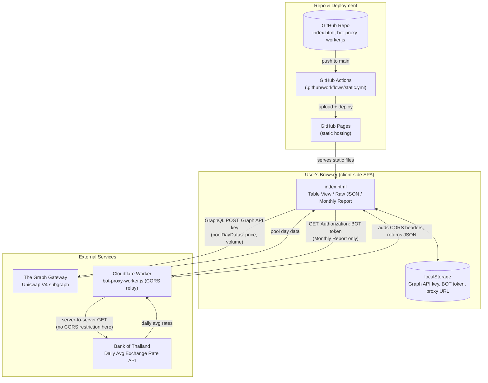

# THBT Uniswap V4 Pool Data Viewer

A static, no-build single-page app for monitoring THBT liquidity pool performance on Uniswap v4 and building a monthly THB exchange-rate comparison report. There is no backend of its own — the browser talks directly to The Graph and (via a small proxy) the Bank of Thailand's exchange rate API.

## Architecture

## How it works

**1. Static frontend, no backend.** `index.html` is the entire application — HTML, CSS and JS in one file, with three tabs: Table View, Raw JSON, and Monthly Report. There's no server, database, or build step of its own.

**2. Config lives in the browser.** The Graph API key, BOT App ID/Token, and the Cloudflare proxy URL are entered once in the UI and cached in `localStorage`, so they persist across visits without touching any server the project controls.

**3. Pool data comes straight from The Graph.** Table View, Raw JSON, and the pool-price/volume side of the Monthly Report all send a GraphQL `POST` directly from the browser to The Graph's hosted Uniswap V4 subgraph, using the user's own API key. Each supported pair (THBT vs. USDT, USDC, EURC, AUDD, XSGD) is defined by two pool IDs — the original pool and the pool it migrated to — so history isn't lost across the migration. Because token0/token1 ordering in a pool is fixed by contract address rather than which token is THBT, the app inspects `pool.token0.symbol` per row and re-orients prices/volumes so THBT is always on the same side of the output.

**4. BOT exchange rates go through a CORS relay.** The Monthly Report also pulls the Bank of Thailand's Daily Average Exchange Rate (THB → USD/EUR/SGD/AUD). `gateway.api.bot.or.th` doesn't send CORS headers, so a browser can't call it directly. `bot-proxy-worker.js` is a small Cloudflare Worker the user deploys themselves: the browser calls the worker, the worker calls BOT server-to-server (no CORS involved there), and adds the CORS headers itself before handing the response back. The worker only ever forwards to that one BOT endpoint and only forwards the `Authorization` header it's given.

**5. Deployment is push-to-deploy.** `.github/workflows/static.yml` deploys the whole repository as static content to GitHub Pages on every push to `main` (or manually via workflow dispatch) — no build artifacts, just the raw files.

## Setup

- Get a Graph API key from [The Graph Studio](https://thegraph.com/studio/apikeys/) and paste it into the app. The Uniswap V4 subgraph ID is already built in.
- To enable the Monthly Report's BOT exchange-rate columns, deploy `bot-proxy-worker.js` as a free [Cloudflare Worker](https://workers.cloudflare.com/) (paste its contents into a new Worker and deploy — no CLI needed), then paste the resulting `*.workers.dev` URL into the app's BOT Proxy URL field.
- Never commit your Graph API key or BOT token into this repo — both are kept client-side in `localStorage` only.
